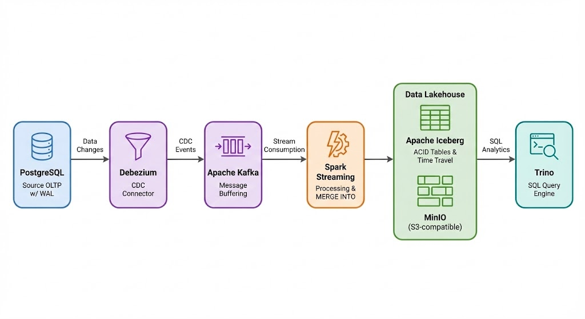
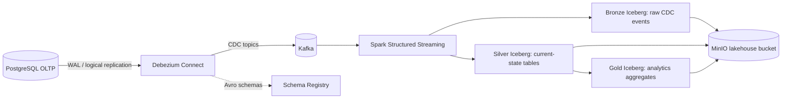

# Real-Time CDC Data Lakehouse



A production-style local data platform that streams PostgreSQL changes into an Iceberg lakehouse with Bronze, Silver, and Gold layers.

## What This Demonstrates

- Multi-table Change Data Capture from PostgreSQL WAL with Debezium
- Kafka-based streaming transport
- Config-driven Spark Structured Streaming ingestion
- Iceberg `MERGE INTO` current-state tables for upserts and deletes
- Bronze/Silver/Gold lakehouse modeling
- Schema Registry path for Avro CDC and schema evolution demos
- MinIO as S3-compatible object storage
- Docker Compose orchestration for local reproducibility

## Architecture



## Lakehouse Layers

| Layer | Purpose | Example Tables |
|---|---|---|
| Bronze | Raw Debezium events with Kafka metadata | `bronze.users_cdc_events`, `bronze.financial_transactions_cdc_events` |
| Silver | Current-state business entities maintained by CDC merges/deletes | `silver.users`, `silver.accounts`, `silver.merchants`, `silver.financial_transactions` |
| Gold | Analytics-ready aggregates rebuilt from Silver | `gold.daily_transaction_summary`, `gold.user_account_summary` |

## CDC Tables

The active source tables are configured in [`pipeline_config.py`](pipeline_config.py):

- `users`
- `merchants`
- `accounts`
- `financial_transactions`

Adding another CDC table means adding metadata in one place: primary key, Kafka topic, and column definitions.

## Quick Start

```bash
cp .env.example .env
make up
make register
make spark-job
make stream-data
```

`make register` uses the JSON Debezium connector, which is the default path for the Spark lakehouse job.

## Schema Registry + Schema Evolution Demo

Start the platform, then register the Avro connector instead of the JSON connector when you want to demonstrate Schema Registry subjects and versions:

```bash
make up
make register-avro
make stream-data
make schema-evolution
make schema-subjects
```

The schema evolution script:

1. Adds `risk_score` to `financial_transactions` if it does not already exist.
2. Inserts a transaction with the new field populated.
3. Prints Schema Registry subjects and versions when the Avro connector is active.

The Spark table config already includes nullable `risk_score`, so older events parse it as `null` and evolved events can flow into Silver.

Use either the JSON connector or the Avro connector for a run, not both at the same time. They publish to the same Debezium topic names with different serialization formats.

## Services

| Service | Port | Purpose |
|---|---:|---|
| PostgreSQL | 5432 | OLTP source database |
| Kafka | 9092 | CDC event transport |
| Debezium Connect | 8083 | PostgreSQL CDC connector runtime |
| Schema Registry | 8081 | Avro schema registration and evolution demo |
| Spark UI | 8080 | Streaming job UI |
| MinIO API | 9000 | S3-compatible object storage |
| MinIO Console | 9001 | Lakehouse bucket inspection |
| Trino | 8085 | Present but not the default query path |

## Useful Commands

```bash
make help              # list available commands
make up                # start services
make register          # register JSON connector for Spark ingestion
make register-avro     # register Avro connector for Schema Registry demo
make spark-job         # submit Spark streaming job
make stream-data       # generate multi-table CDC workload
make schema-evolution  # alter source schema and emit evolved record
make test              # run unit tests when pytest/pyspark are installed
make down              # stop services
make clean             # remove containers and volumes
```

## Notes

- The default streaming job expects JSON Debezium messages with schemas enabled.
- The Avro connector is for the Schema Registry/schema evolution demo path.
- Trino remains outside the main demo path because this repo still uses a Hadoop Iceberg catalog; a REST catalog or Nessie would be the next query-engine upgrade.
