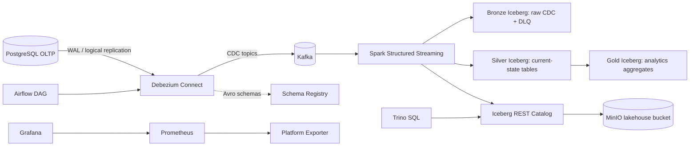

# Real-Time CDC Data Lakehouse


A production-style local data platform that streams PostgreSQL changes into an Iceberg lakehouse with Bronze, Silver, and Gold layers, a shared Iceberg REST catalog, Trino querying, orchestration, observability, DLQ handling, and replay support.

## What This Demonstrates

- Multi-table Change Data Capture from PostgreSQL WAL with Debezium
- Kafka-based streaming transport
- Config-driven Spark Structured Streaming ingestion
- Iceberg `MERGE INTO` current-state tables for upserts and deletes
- Bronze/Silver/Gold lakehouse modeling
- Shared Iceberg REST catalog for Spark writers and Trino readers
- Schema Registry path for Avro CDC and schema evolution demos
- Airflow orchestration for platform checks and connector registration
- Prometheus/Grafana observability with custom platform metrics
- Bronze dead-letter table for malformed CDC events
- Replay from earliest Kafka offsets using isolated checkpoint paths
- Cloud/Kubernetes deployment design notes

## Architecture



## Lakehouse Layers

| Layer | Purpose | Example Tables |
|---|---|---|
| Bronze | Raw Debezium events with Kafka metadata and DLQ events | `bronze.users_cdc_events`, `bronze.dead_letter_events` |
| Silver | Current-state business entities maintained by CDC merges/deletes | `silver.users`, `silver.accounts`, `silver.merchants`, `silver.financial_transactions` |
| Gold | Analytics-ready aggregates rebuilt from Silver | `gold.daily_transaction_summary`, `gold.user_account_summary` |

## CDC Tables

The active source tables are configured in [`pipeline_config.py`](pipeline_config.py):

- `users`
- `merchants`
- `accounts`
- `financial_transactions`

Adding another CDC table means adding metadata in one place: primary key, Kafka topic, and column definitions.

## Quick Start

```bash
cp .env.example .env
make up
make register
make spark-job
make stream-data
```

`make register` uses the JSON Debezium connector, which is the default path for the Spark lakehouse job.

## Query With Trino

Spark and Trino now share the same Iceberg REST catalog.

```bash
make trino-gold
make query
```

Example SQL:

```sql
SELECT * FROM gold.daily_transaction_summary LIMIT 20;
SELECT * FROM silver.financial_transactions LIMIT 20;
SELECT * FROM bronze.dead_letter_events LIMIT 20;
```

## Schema Registry + Schema Evolution Demo

Start the platform, then register the Avro connector instead of the JSON connector when you want to demonstrate Schema Registry subjects and versions:

```bash
make up
make register-avro
make stream-data
make schema-evolution
make schema-subjects
```

The schema evolution script:

1. Adds `risk_score` to `financial_transactions` if it does not already exist.
2. Inserts a transaction with the new field populated.
3. Prints Schema Registry subjects and versions when the Avro connector is active.

The Spark table config already includes nullable `risk_score`, so older events parse it as `null` and evolved events can flow into Silver.

Use either the JSON connector or the Avro connector for a run, not both at the same time. They publish to the same Debezium topic names with different serialization formats.

## Orchestration

Airflow runs at `http://localhost:8088`.

The DAG in [`airflow/dags/cdc_lakehouse_platform.py`](airflow/dags/cdc_lakehouse_platform.py) performs platform readiness checks, registers the JSON connector, and prints connector/schema status. The Spark streaming job remains a long-running service-style job submitted with `make spark-job`.

```bash
make airflow
```

## Observability

```bash
make observability
```

Services:

- Grafana: `http://localhost:3000` with `admin/admin`
- Prometheus: `http://localhost:9090`
- Platform exporter: `http://localhost:9108/metrics`

The dashboard tracks Debezium Connect health, Schema Registry health, Iceberg REST health, connector count, and Schema Registry subject count.

## DLQ + Replay

Malformed or unparseable CDC events are written to `bronze.dead_letter_events` instead of being silently dropped.

```bash
make dlq
make replay
```

Replay uses a new checkpoint path by default, so it can re-read Kafka from earliest offsets without mutating the normal streaming checkpoint.

## Cloud/Kubernetes Path

Cloud and Kubernetes design notes live in [`docs/deployment/cloud-kubernetes.md`](docs/deployment/cloud-kubernetes.md). Minimal Kubernetes skeleton manifests live in [`k8s/`](k8s/).

## Services

| Service | Port | Purpose |
|---|---:|---|
| PostgreSQL | 5432 | OLTP source database |
| Kafka | 9092 | CDC event transport |
| Debezium Connect | 8083 | PostgreSQL CDC connector runtime |
| Schema Registry | 8081 | Avro schema registration and evolution demo |
| Iceberg REST | 8181 | Shared Spark/Trino Iceberg catalog |
| Spark UI | 8080 | Streaming job UI |
| Airflow | 8088 | Orchestration UI |
| MinIO API | 9000 | S3-compatible object storage |
| MinIO Console | 9001 | Lakehouse bucket inspection |
| Trino | 8085 | SQL query engine over Iceberg |
| Prometheus | 9090 | Metrics backend |
| Grafana | 3000 | Dashboard UI |
| Platform Exporter | 9108 | Custom CDC platform metrics |

## Useful Commands

```bash
make help              # list available commands
make up                # start services
make register          # register JSON connector for Spark ingestion
make register-avro     # register Avro connector for Schema Registry demo
make spark-job         # submit Spark streaming job
make stream-data       # generate multi-table CDC workload
make trino-gold        # query Gold Iceberg tables through Trino
make dlq               # inspect dead-letter events
make replay            # replay from earliest offsets with new checkpoint
make schema-evolution  # alter source schema and emit evolved record
make observability     # show Grafana/Prometheus URLs
make airflow           # show Airflow URL
make test              # run unit tests when pytest/pyspark are installed
make down              # stop services
make clean             # remove containers and volumes
```
