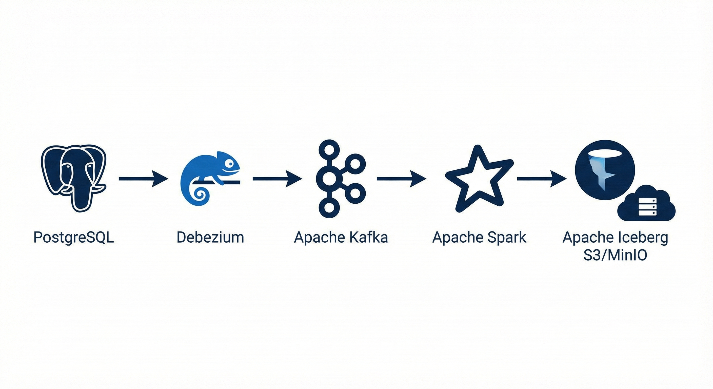
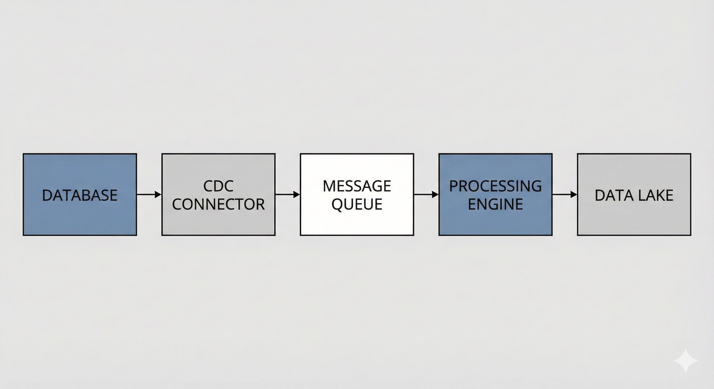

# Real-Time CDC Data Lakehouse


## About

This project demonstrates a real-time data pipeline. When something changes in a database (insert, update, delete), that change automatically flows into a data lake for analytics.

The goal was to understand how streaming data pipelines work - capturing every database change and processing it in real-time, similar to what companies like Netflix or Uber do.

### The Problem

Traditional ETL jobs run on schedules (like once a day). This means data in the analytics layer is always stale. If a transaction happens at 2pm, it might not show up in reports until the next morning.

### The Solution

This pipeline uses Change Data Capture (CDC) to stream changes as they happen. Debezium watches the PostgreSQL transaction log and sends every change to Kafka immediately. Spark picks up these events and merges them into Iceberg tables. The result is near real-time data in the lakehouse.

The key part is the MERGE INTO operation - it handles inserts, updates, and deletes properly, so the lakehouse always reflects the current state of the source database.

## What It Does



- Watches a PostgreSQL database for changes
- Captures those changes using Debezium (CDC tool)
- Sends them through Kafka
- Processes with Spark Streaming
- Stores in Iceberg tables (modern data lake format)



## Tech Stack

- **PostgreSQL** - source database
- **Debezium** - captures insert/update/delete events
- **Kafka** - message queue
- **Spark** - stream processor
- **Iceberg** - table format with ACID support
- **MinIO** - S3-compatible storage
- **Docker** - containerization

## How to Run

```bash
# Setup environment
cp .env.example .env

# Start services
docker-compose up -d

# Copy Spark script
docker cp spark_streaming.py spark-master:/tmp/

# Register CDC connector
curl -X POST http://localhost:8083/connectors -H "Content-Type: application/json" -d @debezium-connector.json

# Run streaming job
docker exec -it spark-master /opt/spark/bin/spark-submit --packages org.apache.spark:spark-sql-kafka-0-10_2.12:3.5.0,org.apache.iceberg:iceberg-spark-runtime-3.5_2.12:1.4.2,org.apache.hadoop:hadoop-aws:3.3.4,com.amazonaws:aws-java-sdk-bundle:1.12.262 /tmp/spark_streaming.py

# Generate test data
python data_generator.py
```

## Services

| Service | Port |
|---------|------|
| PostgreSQL | 5432 |
| Kafka | 9092 |
| Debezium | 8083 |
| Spark UI | 8080 |
| MinIO | 9001 |

## Issues

> Trino doesn't work with the current setup. Trino 435 doesn't support `iceberg.catalog.type=hadoop`. To fix this, you'd need to add a REST catalog like Nessie. For now, use Spark SQL to query the Iceberg tables instead.
